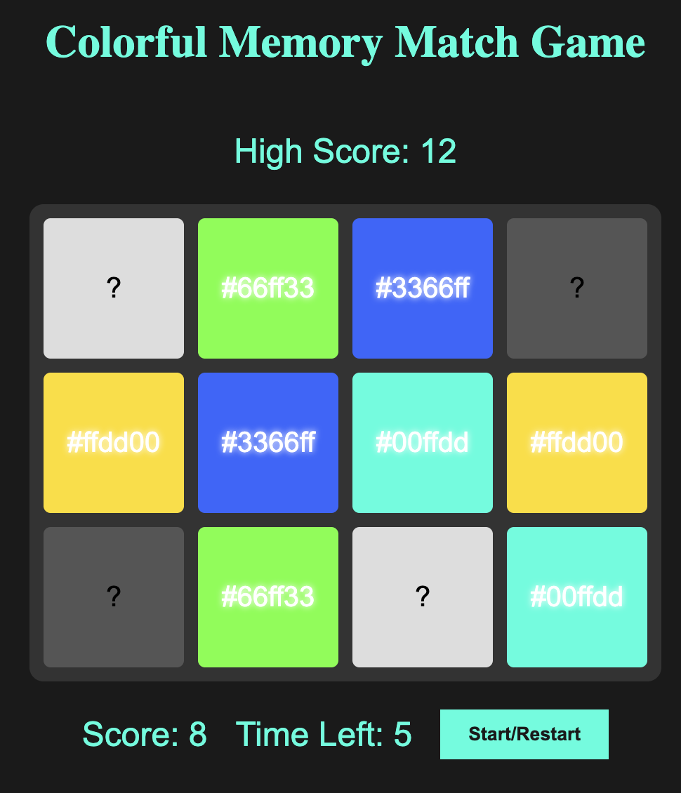

# Memory Match Game

A fast-paced, color-matching memory game built with vanilla JavaScript, HTML, and CSS. Flip cards, find the matching pairs, and beat the timer.

## Live Demo

[Play the Game](https://better-code-saul-e.github.io/Memory_Match_Game/)  

---

## Features

- Match pairs of colorful cards
- 30-second countdown timer
- High score saved using local storage
- Locked board during card animations
- Replayable with shuffled cards each round

---

## Screenshots

